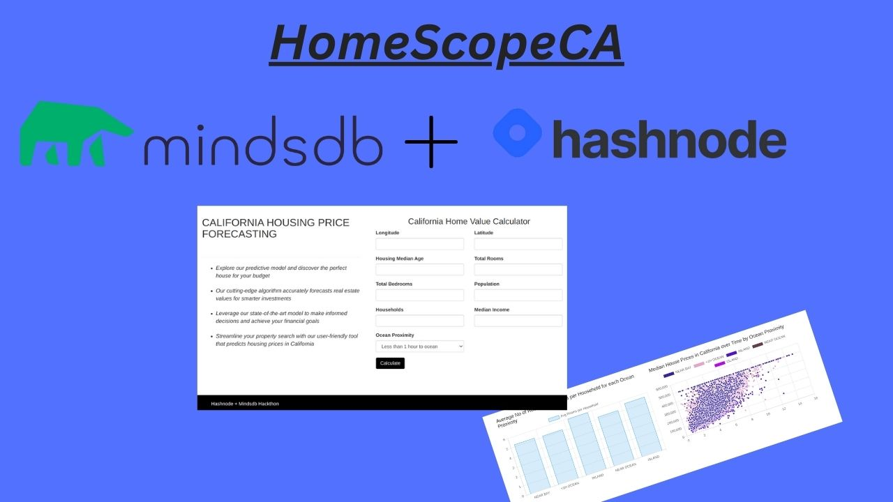

# HomeScopeCA

HomeScopeCA is a web application that uses MindsDB AI & Node.js to predict or forecast house prices in California. The prediction is based on the trained machine-learning model developed using historical data on house prices in California. 

HomeScopeCA is a powerful web application that can provide valuable insights to anyone who is interested in buying & selling property in California. 

### License
[MIT](https://choosealicense.com/licenses/mit/)
### Demo Url 
[[Demo Live Site]](http://45.79.31.246:3000/)
### Screenshot


## Tech Stack

 - HTML, Bootstrap 3, Chart.js , EJS template engine, MindsDB JavaScript SDK (Frontend).
 - Express, Node.js (Backend).
 - MindsDB (Machine Learning, AI Tables)
 - Linode Cloud (For Hosting Mindsdb docker image, Node.js on linode VM) 


## System requirements

 - 4 core cpu Intel or Amd.
 - 6 gb ram.
 - 30 gb hard disk.
 - Installed latest Docker Engine.
 - Installed latest Node.js & Npm.
 - Ubuntu (Recommend) or Mac os or Windows.
 - 4 gb data to download mindsdb docker image.

## Project Flow

 - A user who want to predit the house price in CA can visit the site home page.
 - In the form the user have to enter the values required to predit the house price in CA.
 - After submiting form the request is sent to mindsdb server by node.js server to predit the house price for the given input.
 - The node.js server get the response from the mindsdb server with the data. 
 - In the result page the value of the house price, Ocean proximity along with the California median values by Ocean Proximity is displayed. 
 - The user can view the average no of rooms, median price in CA over time in the Bar chart & Scatter Plot by clicking the dashboard page on the upper right of the home page.
 
## Installation

Steps to run app on localhost

Step 1] Clone the project from github:   
```bash
  git clone https://github.com/bakkeshks/HomeScopeCA.git
```
Step 2] Install the dependencies:
```bash
  npm install
```
Step 3] Install the latest version of MindsDB Docker Image & run the docker:
```bash
  docker pull mindsdb/mindsdb
  sudo systemctl start docker
```
Step 4] Download the dataset from kaggle: 
```bash
https://www.kaggle.com/datasets/camnugent/california-housing-prices
```
Step 5] Go to http://localhost:47334 & select the option to upload the data through files (.csv).

Step 6] Import the housing.csv & give home_table as the name of the table in the datasource name field.

Step 7] After you press save , it will import data to files database and it had created home_table in the files. 

Step 8] Once table is created , you have to create & train the model with the data.

Step 9] Now you can write the query & predit the value in the mindsdb editor.

Step 10] Start the node.js server on your machine:
```bash
node app.js 
```
